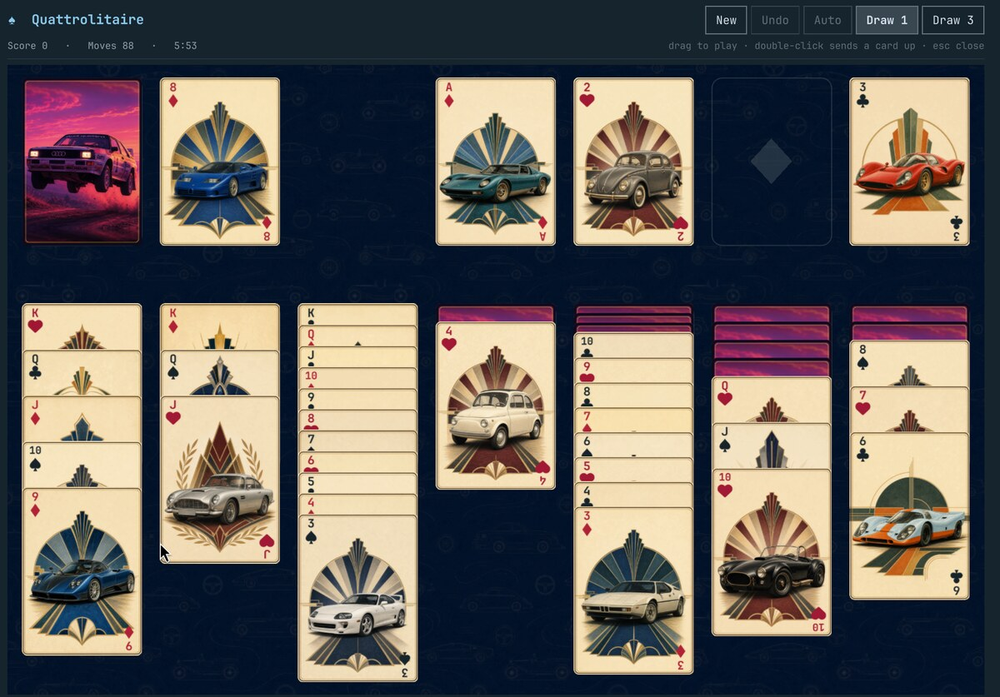

# Quattrolitaire

Klondike solitaire as a native Omarchy shell plugin. A drag-and-drop card
table with an illustrated art-deco deck, on felt coloured from the active
Omarchy theme. The deck ships in the repo, so there is nothing to fetch and
nothing to build.



- Draw 1 or draw 3, switchable mid-game
- Drag a card or a run; double-click sends a card straight to a foundation
- Unlimited undo, standard Klondike scoring with a time bonus
- **Auto** finishes the game once every card is face up
- The game in progress is saved, so it survives closing the panel *and*
  restarting the shell

## Install

```bash
omarchy plugin add https://github.com/28allday/Quattrolitaire --enable
```

Or with the installer, which does the same thing and places the bar icon:

```bash
./install.sh
```

Then click the ♠ in the bar, or bind a key to:

```bash
omarchy-shell shell toggle nosignal.quattrolitaire
```

`install.sh` takes two optional overrides: `QUATTROLITAIRE_SECTION` picks the
bar section (`left`, `center` or `right`, default `right`), and
`QUATTROLITAIRE_REPO` registers the plugin from a fork instead.

## Removal

```bash
omarchy plugin remove nosignal.quattrolitaire
```

That unregisters the plugin and drops its bar icon. The saved game is left
behind; delete it too with:

```bash
rm -rf ~/.local/state/omarchy-quattrolitaire
```

## Dependencies

Omarchy 4 and its shell — no other runtime dependency for play itself. One
piece of plumbing needs **`jq`**, which Omarchy already installs: see below.

## What it writes, and what it does not

- `~/.local/state/omarchy-quattrolitaire/state.json` — the game in progress,
  the draw mode and the win record. Written after each move.
- `~/.config/omarchy/shell.json` — **on first open**, the plugin appends its
  own `{"id": "nosignal.quattrolitaire"}` entry to `plugins[]` if one is not
  already there, using `jq`. This is a workaround: `omarchy plugin enable`
  writes only the bar-layout entry for a plugin that is both a panel and a
  bar widget, so without that entry the keybinding stops working the moment
  the bar icon is removed. The edit is idempotent, appends only, changes no
  other setting, and goes away once upstream
  [PR #6510](https://github.com/basecamp/omarchy/pull/6510) lands. The code
  is at the top of `Panel.qml` if you would rather read it than take my word.

Nothing else on the system is touched. The plugin makes **no network
requests**, needs no credentials, runs nothing privileged, and starts no
process beyond the `jq` edit above and a `mkdir -p` for its own state
directory.

## Scoring

Standard Klondike: +10 onto a foundation, +5 for waste-to-tableau, +5 for
turning a tableau card face up, −15 for taking a card back off a foundation,
and a recycle penalty of −100 in draw-1 (−20 in draw-3). Finishing in over
30 seconds adds a time bonus; finishing faster is worth more.

## Where things live

| Path | What |
| --- | --- |
| `manifest.json` | Plugin manifest — `panel` + `bar-widget`, `keepLoaded` |
| `Panel.qml` | The whole game: model, layout, cards, drag, cascade |
| `cards/` | The deck: 52 faces, a shared back, and the table tile |
| `BarWidget.qml` | Bar icon; toggles the panel over shell IPC |
| `~/.local/state/omarchy-quattrolitaire/state.json` | Saved game, draw mode, win record |

## Card art

The 52 faces are an original art-deco series, one famous car per card, bundled
in `cards/`. The back is reframed from **vulturetone**'s `1-quattro.jpg`, the
rally-car wallpaper in Omarchy's stock `tokyo-night` theme — with thanks, and
the reason this thing is called Quattrolitaire. See
[cards/CREDITS.md](cards/CREDITS.md), which also covers swapping in a deck of
your own. The table around the cards is
drawn from the active theme, so the felt, the pile outlines and the panel
chrome recolour with the desktop while the deck stays as painted.

## Licence

MIT, artwork included. The card back comes from vulturetone's `tokyo-night`
wallpaper, credited in [cards/CREDITS.md](cards/CREDITS.md). Klondike itself
is a public-domain card game.
